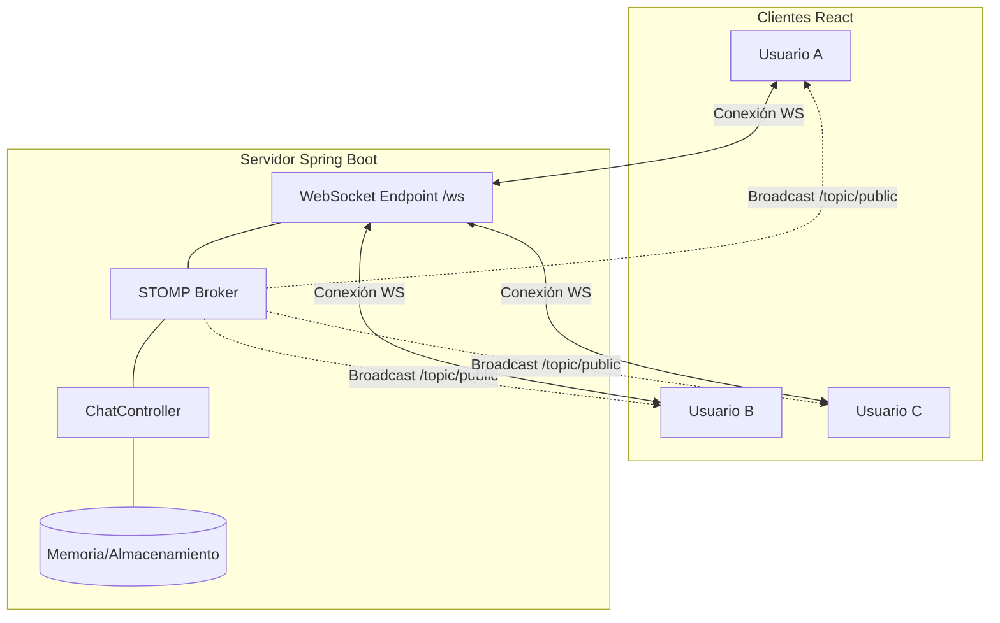
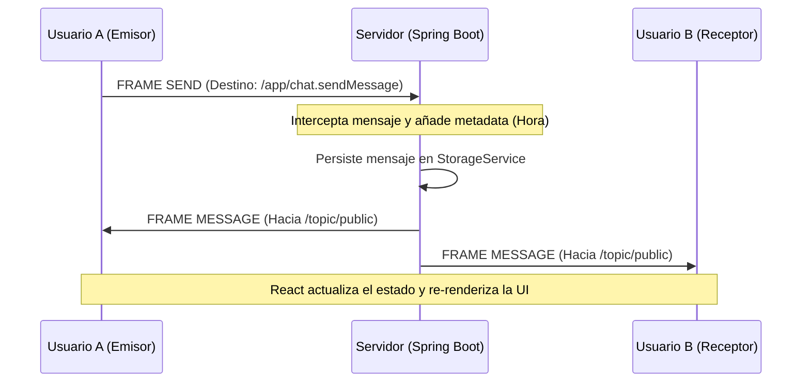

# Documentación Técnica: NexusChat Web (V2)

## 1. Justificación de Tecnologías

Para este proyecto, se ha optado por una **Arquitectura Web en Tiempo Real**, alejándonos de las soluciones de escritorio tradicionales (como Java Swing). Esta decisión se justifica por la necesidad de una interfaz dinámica, escalable y visualmente atractiva que cumpla con los estándares actuales de aplicaciones de mensajería como Discord o Slack.

- **Backend (Spring Boot + WebSockets)**: La arquitectura se basa en **WebSockets sobre TCP**. Se ha utilizado el protocolo **STOMP** (*Simple Text Oriented Messaging Protocol*) para gestionar la mensajería. Spring Boot actúa como un "Broker" de mensajes, lo que facilita el patrón **Publish/Subscribe**. Esta elección permite que la comunicación sea bidireccional y de baja latencia, ideal para un chat.
- **Frontend (React + Vite)**: El cliente se ha desarrollado con **React**, permitiendo una gestión del estado eficiente. Gracias a esto, la interfaz se actualiza de forma reactiva al recibir nuevos mensajes o cambios en la lista de usuarios, sin necesidad de refrescar la página.
- **Protocolo WebRTC (Videollamadas)**: Para la funcionalidad de llamadas, se ha implementado **WebRTC** (Web Real-Time Communication). Esto permite la transmisión de audio y vídeo *peer-to-peer* (punto a punto) entre clientes, utilizando el servidor de WebSockets únicamente como canal de señalización inicial.
- **Diseño UI/UX (Glassmorphism)**: Se ha implementado un sistema de diseño propio basado en CSS nativo, utilizando efectos de cristal translúcido (*backdrop-filter*) y una paleta de colores neon-dark para ofrecer una experiencia de usuario premium.

---

## 2. Arquitectura y Diagramas

### 2.1 Diagrama de Arquitectura Global (Pub/Sub)

La comunicación se centraliza en un servidor que distribuye los mensajes a los clientes suscritos a diferentes "topics".



### 2.2 Diagrama de Secuencia: Envío de Mensaje

El flujo de un mensaje desde que el usuario pulsa "Enviar" hasta que aparece en la pantalla de los demás.



### 2.3 Diagrama de Señalización WebRTC (Llamadas)

Para establecer una llamada, los clientes usan el chat como puente para intercambiar su información de conexión.

```mermaid
sequenceDiagram
    participant U1 as Emisor (Llama)
    participant S as Servidor WS (Puente)
    participant U2 as Receptor (Recibe)

    U1->>S: Enviar VIDEO_OFFER (SDP)
    S->>U2: Reenviar VIDEO_OFFER a destino privado
    U2->>S: Enviar VIDEO_ANSWER (SDP)
    S->>U1: Reenviar VIDEO_ANSWER
    U1<-->>U2: Intercambio de ICE Candidates (Vía WS)
    Note over U1,U2: Conexión P2P establecida directamente
    U1<==>U2: Flujo de Vídeo/Audio (Fuera del Servidor)
```

---

## 3. Explicación del Protocolo STOMP

STOMP es un protocolo sencillo orientado a texto que funciona sobre WebSockets. Sus principales ventajas en este proyecto son:

1.  **Destinos (Destinations)**: Permite diferenciar entre canales públicos (`/topic/public`) y mensajes dirigidos al servidor (`/app/...`).
2.  **Cabeceras (Headers)**: Podemos enviar metadatos (como el nombre del remitente o el tipo de mensaje) sin necesidad de ensuciar el cuerpo del mensaje.
3.  **Frames**: La comunicación se divide en "Frames" (CONNECT, SUBSCRIBE, SEND, MESSAGE), lo que estandariza el flujo de datos y facilita la depuración frente a Sockets puros de texto plano.
