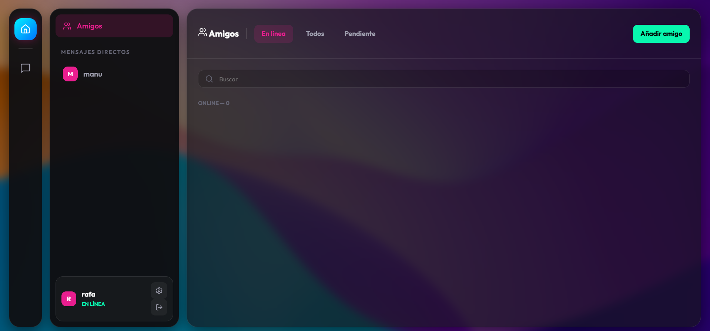

# NexusChat Web - Plataforma de Mensajes y Videollamadas

NexusChat es una aplicación de mensajería en tiempo real que combina la robustez de **Spring Boot** en el servidor con la fluidez de **React** en el cliente. Diseñada bajo una estética moderna de *Glassmorphism*, ofrece una experiencia de comunicación completa que incluye chat público, mensajes directos, intercambio de multimedia y videollamadas.



## 📺 Demo en Vídeo


## 🚀 Características Principales

- **Mensajería Instantánea**: Comunicación bidireccional de baja latencia mediante WebSockets y protocolo STOMP.
- **Salas y DMs**: Canal general compartido y sistema de mensajes privados entre amigos.
- **Videollamadas P2P**: Integración de WebRTC para llamadas de audio y vídeo de alta calidad directamente entre navegadores.
- **Multimedia**: Soporte para envío de imágenes, selector de GIFs integrado y grabadora de notas de voz.
- **Personalización**: Temas de color dinámicos, biografía de usuario, avatares personalizados y fondos de aplicación configurables.
- **Diseño Premium**: Interfaz oscura con efectos de cristal translúcido, desenfoques y animaciones suaves.

## 🛠️ Stack Tecnológico

- **Backend**: Java 17, Spring Boot, Spring WebSocket, Spring Messaging.
- **Frontend**: React 18, Vite, Lucide Icons, SockJS, StompJS.
- **Protocolos**: WebSockets, STOMP, WebRTC.
- **Estilos**: CSS3 nativo (Variables CSS, Flexbox, Grid, Backdrop-filters).

## 📦 Instalación y Ejecución

### Requisitos previos
- JDK 17 o superior.
- Node.js (v18+) y npm.

### Paso 1: Levantar el Backend
```bash
cd backend
./mvnw spring-boot:run
```
El servidor estará disponible en `http://localhost:8080`.

### Paso 2: Levantar el Frontend
```bash
cd frontend
npm install
npm run dev
```
La aplicación se abrirá en `http://localhost:5173`.

## 📂 Estructura del Proyecto

```text
NexusChat/
├── backend/            # Servidor Spring Boot (Maven)
│   ├── src/main/java   # Lógica de Sockets y Controladores
│   └── pom.xml         # Dependencias
├── frontend/           # Cliente React (Vite)
│   ├── src/            # Componentes, estilos y lógica WebRTC
│   └── package.json    # Scripts y dependencias
├── Documentacion_Tecnica.md  # Justificación y diagramas
└── Memoria_IA.md             # Histórico y uso de asistencia IA
```

## 📝 Autor
Proyecto desarrollado por Rafael Hidalgo Torres.
